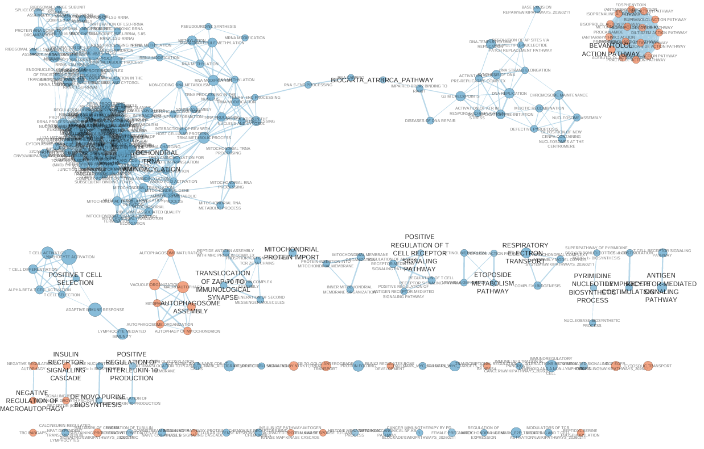
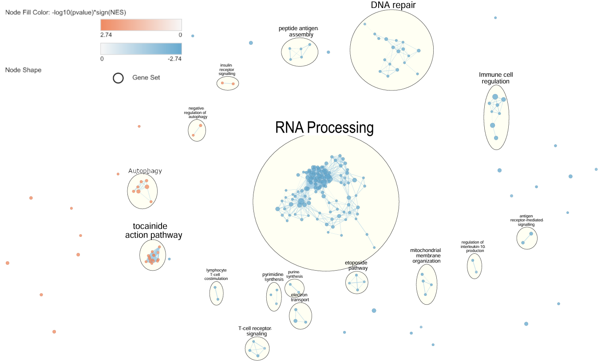

```{r, message=FALSE, warning=FALSE}
if (!requireNamespace("knitr", quietly = TRUE)) {
  install.packages("knitr")
}
if(!requireNamespace("readxl", quietly = TRUE)) {
  install.packages("readxl")
}
if(!requireNamespace("gt", quietly = TRUE)) {
  install.packages("gt")
}
library(knitr)
library(RCurl)
library(gprofiler2)
library(dplyr)
library(tibble)
library(stringi)
library(BiocGenerics)
library(data.table)
library(GEOquery)
library(readxl)
library(biomaRt)
library(edgeR)
library(SummarizedExperiment)
library(DESeq2)
library(ggplot2)
library(ComplexHeatmap)
library(circlize)
library(tidyr)
library(gt)
```

This workbook uses the GEOQuery [@Davis2007], biomaRt [@Durinck2005], tibble [@Mueller2025], readxl[@Wickham2025], dplyr [@Wickham2023], tidyr [@Wickham2025a], knitr [@Xie2014], DESeq2 [@Love2014], edgeR [@Chen2025], SummarizedExperiment[@Morgan2025], ggplot2 [@Wickham2016], ComplexHeatmap [@Gu2022], data.table [@Barrett2006], RCurl [@TempleLang2025], BiocGenerics [@Huber2015], stringi [@Gagolewski2022], gt [@Iannone2026] and circlize [@Gu2014] packages in its code chunks.

# Introduction

Septic shock is a complication of sepsis with severe and potentially fatal consequences. Treatment for septic shock is largely dependent on supportive hemodynamic therapy, but patient response to such therapies is variable, and while some septic shock patients, responders, exhibit significant improvement of organ function within a few days of treatment in the ICU, other patients, non-responders, do not exhibit early improvement. Changes in organ function during the early stages of treatment are highly predictive of final outcome, and fatal cases of septic shock are associated with major transcriptomic changes in the initial stages of the condition, so the distinction of gene expression profiles associated with responders and non-responders is informative as to the mechanisms underlying septic shock mortality.

The NCBI Gene Expression Omnibus (GEO) [@Barrett2012] series GSE110487 is a dataset from 2018 consisting of RNA sequencing read counts of whole blood samples taken from 14 septic shock patients who responded to hemodynamic therapy (R group) and 17 non-responders (NR group), at two time points: immediately after ICU admission (T1), and 48 hours later (T2), after some time undergoing treatment.

In Assignment 1, we downloaded the dataset of 58096 genes and 62 samples. Since the data used HGNC identifiers for the genes, we mapped these to ENSG identifiers and cleaned out low expression genes, leaving us with 13673 genes. We visualized and compared raw and normalized read counts with MDS plots, and noted the similarity of their distribution. We then analyzed differential expression between the R patients and the NR patients at each time point, and we analyzed differential expression between T1 and T2 in each group. We noted no differentially expressed genes above our significance threshold between the R and NR groups at T1, and 67 differentially expressed genes between the patient groups at T2, so we determined that analyzing differential expression between R and NR at T2 would provide insight into the difference between the transcriptomic responses of the two groups to hemodynamic therapy. We concluded by visualizing the genes that were differentially expressed in R vs. NR at T2 with a volcano plot and a heatmap. The code used in assignment 1 is contained and hidden in this notebook.

```{r, include=FALSE}
geo_id <- "GSE110487"

# get metadata associated with gse and supplementary files
gse <- GEOquery::getGEO(geo_id, GSEMatrix=FALSE)
supp <- GEOquery::getGEOSuppFiles(geo_id, fetch_files=FALSE)

# download data if not already downloaded
current_dir <- file.path(getwd())
supp_file_path <- file.path(current_dir, geo_id, supp$fname[1])
if (!file.exists(supp_file_path)) {
  data_file <- GEOquery::getGEOSuppFiles(GEO = geo_id)
}

# read data into a dataframe
raw_counts <- readxl::read_xlsx(supp_file_path)

# take a peek
knitr::kable(raw_counts[1:5, 1:10], format = "html", align = "c")

# count genes and samples
cat(paste("Number of genes: ", nrow(raw_counts),
          "\nNumber of samples: ", ncol(raw_counts)-1))

# retrieve list of samples in the series, and compile condition data for each
samples <- gse@gsms
sample_sources <- do.call(rbind, 
                             lapply(samples, FUN=function(x){
                               c(x@header$title,
                                 x@header$source_name_ch1)}))

# Use this data to create a dataframe mapping sample titles to responder status and time point
sample_metadata <- as.data.frame(sample_sources, stringsAsFactors = FALSE)
colnames(sample_metadata) = c("sample", "source")
sample_metadata <- sample_metadata %>% 
  magrittr::set_rownames(.$sample) %>% 
  mutate(
    response = ifelse(grepl("^Responder", source), "R", "NR"),
    time_point = ifelse(grepl("T1", source), "T1", "T2"),
  ) %>% 
  dplyr::select(response, time_point)

# take a peek
knitr::kable(sample_metadata[1:5,], format = "html", align = "c")

# calculating summary statistics for each sample
sample_summaries <- data.frame(do.call(cbind, lapply(raw_counts[, 2:ncol(raw_counts)], summary)))
qual_overview <- as.data.frame(t(sample_summaries))

# Adding extra statistics for total reads, number of genes with zero expression, number of genes with low expression
qual_overview <- qual_overview %>% 
  dplyr::mutate(total_reads = colSums(raw_counts[2:ncol(raw_counts)]),
                zero_exp = colSums(raw_counts[2:ncol(raw_counts)] == 0),
                low_exp = colSums(raw_counts[2:ncol(raw_counts)]<10),
                )

# adding metadata to sort by conditions
qual_overview <- merge(qual_overview, sample_metadata, by = 0)

# overview stats for samples from non-responders and responders
stats_by_response <- qual_overview %>%
  dplyr::group_by(response,) %>%
  summarize(
    NumSamples = n(),
    MeanLibSize = mean(total_reads),
    SDLibSize = sd(total_reads),
    PropZeroExp = mean(zero_exp) / nrow(raw_counts),
    PropLowExp = mean(low_exp) / nrow(raw_counts),
  )

# overview stats for samples from time point 1 and time point 2
stats_by_time <- qual_overview %>%
  dplyr::group_by(time_point,) %>%
  summarize(
    NumSamples = n(),
    MeanLibSize = mean(total_reads),
    SDLibSize = sd(total_reads),
    PropZeroExp = mean(zero_exp) / nrow(raw_counts),
    PropLowExp = mean(low_exp) / nrow(raw_counts),
  )

# merging tables and displaying
stats_by_condition <- bind_rows(
    stats_by_response %>% 
        dplyr::mutate(group_type = "response") %>%
        dplyr::rename(condition = response),
    stats_by_time %>% 
        dplyr::mutate(group_type = "time_point") %>%
        dplyr::rename(condition = time_point)
    )
knitr::kable(stats_by_condition[,1:6], format = "html", align = "c")

# get ensembl version 100 and the human gene dataset
ensembl <- biomaRt::useEnsembl(biomart = "ensembl")
ensembl <- biomaRt::useDataset("hsapiens_gene_ensembl", mart = ensembl)

# store ensembl IDs from the data as a vector
ensembl_ids <- raw_counts$Geneid

# check if an ensembl to hgnc conversion file exists already
conversion_stash <- "ensembl_to_hgnc.rds"
if (file.exists(conversion_stash)) {
  
  # if the file exists, read conversion data from that
  ensembl_to_hgnc <- readRDS(conversion_stash)
} else {
  
  # if the file does not exist, get conversion data from biomaRt and cache it
  ensembl_to_hgnc <- biomaRt::getBM(attributes = c("ensembl_gene_id", "hgnc_symbol"),
                         filters = c("ensembl_gene_id"),
                         values = ensembl_ids,
                         mart = ensembl)
  saveRDS(ensembl_to_hgnc, conversion_stash)
}

# merge conversion df with data and rearrange such that both id columns come before samples
raw_counts_annot <- dplyr::left_join(raw_counts, ensembl_to_hgnc, 
                                     by = c("Geneid" = "ensembl_gene_id"))
raw_counts_cols <- dplyr::setdiff(names(raw_counts), "Geneid")
colnames(raw_counts_annot)[1] = "ensembl_gene_id"
raw_counts_annot <- raw_counts_annot[, c("ensembl_gene_id", "hgnc_symbol", raw_counts_cols)]

# peek at annotated counts
knitr::kable(raw_counts_annot[1:5, 1:10], format = "html", align = "c")

# subset rows where one ensembl id maps to multiple hgnc symbols
ensembl_dups <- raw_counts_annot$ensembl_gene_id[duplicated(raw_counts_annot$ensembl_gene_id)]
multiple_hgnc <- raw_counts_annot %>% 
  filter(ensembl_gene_id %in% ensembl_dups)

# subset rows where multiple ensembl ids map to one hgnc symbol
hgnc_dups <- raw_counts_annot$hgnc_symbol[duplicated(raw_counts_annot$hgnc_symbol)]
same_hgnc <- raw_counts_annot %>% 
  filter(hgnc_symbol %in% hgnc_dups & hgnc_symbol != "")

# subset rows where ensembl id does not map to a hgnc symbol 
unmapped <- raw_counts_annot %>% 
  filter(is.na(hgnc_symbol) | hgnc_symbol == "")

cat(paste(nrow(unmapped), "unmapped rows\n",
          nrow(multiple_hgnc), 
          "rows where one ENSG ID maps to multiple HGNC symbols \n",
          nrow(same_hgnc), 
          "rows where multiple ENSG IDs map to the same HGNC symbol"))

# size of smallest condition group in the dataset: non-responders at time point 1/2
smallest_group_size <- 11

# keep only unmapped rows that have a count of at least 10 in 11 samples
rows_to_keep <- rowSums(unmapped >= 10) >= smallest_group_size
clean_unmapped <- unmapped[rows_to_keep,]

# subset mapped counts 
mapped <- raw_counts_annot %>% 
  filter(!is.na(hgnc_symbol) & hgnc_symbol != "")

# apply same expression filter to mapped counts 
rows_to_keep <- rowSums(mapped >= 10) >= smallest_group_size
clean_mapped <- mapped[rows_to_keep,]

# collate and display results of filtering
cleaning_results <- data.frame(
  Type = c("mapped genes", "unmapped genes"),
  PreCleanCount = c(nrow(mapped), nrow(unmapped)),
  PostCleanCount = c(nrow(clean_mapped), nrow(clean_unmapped)),
  SignificantProportion = c(nrow(clean_mapped)/nrow(mapped), 
                     nrow(clean_unmapped)/nrow(unmapped))
)
knitr::kable(cleaning_results, format = "html", align = "c")

# create a new dataframe where rows correspond to unique hgnc symbols
clean_counts_byhgnc <- clean_mapped %>% 
  dplyr::group_by(hgnc_symbol) %>% 
  # sum rows that map to the same hgnc symbol
  dplyr::summarise(dplyr::across(dplyr::where(is.numeric), ~ sum(.x, na.rm = TRUE)))

knitr::kable(clean_counts_byhgnc[1:5, 1:10], format = "html", align = "c")

cat(paste("Number of genes: ", nrow(clean_counts_byhgnc),
          "\nNumber of samples: ", ncol(clean_counts_byhgnc)-1))

# extract counts as a matrix and set row and column names
clean_count_matrix <- as.matrix(clean_counts_byhgnc[,2:ncol(clean_counts_byhgnc)])
rownames(clean_count_matrix) <- clean_counts_byhgnc$hgnc_symbol
colnames(clean_count_matrix) <- colnames(clean_counts_byhgnc)[2:ncol(clean_counts_byhgnc)]

#create a variable in the metadata from the interaction of response and time_point
sample_metadata$group = interaction(sample_metadata$response, 
                                      sample_metadata$time_point, 
                                      sep = "_")

# create a DESeqDataSet object from the counts matrix and the sample metadata, using the interaction of response and time point as the design. 
counts_dds <- DESeq2::DESeqDataSetFromMatrix(countData = clean_count_matrix,
                                             colData = sample_metadata,
                                             design = ~group)

# estimate normalization factors and apply them to counts
counts_dds <- DESeq2::estimateSizeFactors(counts_dds)
norm_counts <- DESeq2::counts(counts_dds, normalized = TRUE)

# create SummarizedExperiment objects with un-normalized and normalized counts
unnorm_counts <- DESeq2::counts(counts_dds, normalized = FALSE)
unnorm_counts_se <- SummarizedExperiment(assays = list(counts = unnorm_counts),
                                         colData = sample_metadata)
norm_counts_se <- SummarizedExperiment(assays = list(counts = norm_counts), 
                                       colData = sample_metadata)

# generate MDS data with un-normalized counts
unnorm_mds <- edgeR::plotMDS.SummarizedExperiment(unnorm_counts_se, plot = FALSE)
unnorm_mds_df <- data.frame(
  Dim1 = unnorm_mds$x,
  Dim2 = unnorm_mds$y,
  Group = unnorm_counts_se$group,
  Sample = colnames(unnorm_counts_se)
)

# generate MDS data with normalized counts
norm_mds <- edgeR::plotMDS.SummarizedExperiment(norm_counts_se, plot = FALSE)
norm_mds_df <- data.frame(
  Dim1 = norm_mds$x,
  Dim2 = norm_mds$y,
  Group = norm_counts_se$group,
  Sample = colnames(norm_counts_se)
)

# plot un-normalized MDS  
ggplot2::ggplot(unnorm_mds_df, aes(x = Dim1, y = Dim2, color = Group)) +
  geom_point(size = 3) +
  theme_minimal() +
  labs(
    x = paste("Dim1 (", round(unnorm_mds$var.explained[1]*100, 1), "%)"),
    y = paste("Dim2 (", round(unnorm_mds$var.explained[2]*100, 1), "%)"),
    title = "MDS plot: un-normalized counts"
  )

# plot normalized MDS
ggplot2::ggplot(norm_mds_df, aes(x = Dim1, y = Dim2, color = Group)) +
  geom_point(size = 3) +
  theme_minimal() +
  labs(
    x = paste("Dim1 (", round(norm_mds$var.explained[1]*100, 1), "%)"),
    y = paste("Dim2 (", round(norm_mds$var.explained[2]*100, 1), "%)"),
    title = "MDS plot: normalized counts"
  )

# evaluate differential expression. Appropriate design already specified in counts_dds
counts_dds <- DESeq2::DESeq(counts_dds)

# DE between R and NR at T1
response_T1 <- DESeq2::results(counts_dds, contrast = c("group", "NR_T1", "R_T1"), alpha = 0.05)
summary(response_T1)

# DE between R and NR at T2 
response_T2 <- DESeq2::results(counts_dds, contrast = c("group", "NR_T2", "R_T2"), alpha = 0.05)
summary(response_T2)

# DE between T1 and T2 for NR patients
time_NR <- DESeq2::results(counts_dds, contrast = c("group", "NR_T1", "NR_T2"), alpha =0.05)
summary(time_NR)

# DE between T1 and T2 for R patients
time_R <- DESeq2::results(counts_dds, contrast = c("group", "R_T1", "R_T2"), alpha = 0.05)
summary(time_R)

# get genes with adjusted p-value < 0.05 for each test
sig_T1 <- response_T1[response_T1$padj < 0.05,]
sig_T2 <- response_T2[response_T2$padj < 0.05,]
sig_NR <- time_NR[time_NR$padj < 0.05,]
sig_R <- time_R[time_R$padj < 0.05,]

cat(paste(nrow(sig_T1), "DE genes between R and NR at T1\n",
          nrow(sig_T2), "DE genes between R and NR at T2\n",
          nrow(sig_NR), "DE genes from T1 to T2 in NR\n",
          nrow(sig_R), "DE genes from T1 to T2 in R"))

# convert DE results to data frame
difexp_info <- as.data.frame(response_T2)

# add column indicating whether genes are significantly up or downregulated
difexp_info$DE <- "no"
difexp_info$DE[difexp_info$log2FoldChange > 0 & difexp_info$padj < 0.05] <- "up"
difexp_info$DE[difexp_info$log2FoldChange < 0 & difexp_info$padj < 0.05] <- "down"

# generate volcano plot, -log10 of adjusted p-val vs log2 of FC
ggplot2::ggplot(data = difexp_info, mapping = aes(x = log2FoldChange, y = -log10(padj), col = DE)) + 
  geom_point() +
  theme_minimal() + 
  geom_hline(yintercept = -log10(0.05), col = "black", linetype = 'dashed') + 
  scale_color_manual(values = c("blue", "grey", "red"),
                     labels = c("Downregulated in R group", "Not DE", "Upregulated in R group")) +
  labs(color = "Expression", 
       x = "log 2 fold change",
       y = "log 10 corrected p-value",
       title = "Expression of genes in R vs. NR samples at T2")

# use normalized counts for heatmap matrix, filter for DE genes
normcounts_heatmap <- norm_counts[rownames(norm_counts) %in% rownames(sig_T2),]

# normalize rows
normcounts_heatmap <- t(scale(t(normcounts_heatmap)))

# set colours to scale from blue at min values to white at 0 to red at max values
heatmap_col = circlize::colorRamp2(c(min(normcounts_heatmap), 0, max(normcounts_heatmap)),
                                   c("blue", "white", "red"))

# set colours to correspond to experimental conditions
group_colours <- rainbow(n = 4)
names(group_colours) <- unique(sample_metadata$group)

# add annotation with experimental conditions and corresponding colours
hannot <- ComplexHeatmap::HeatmapAnnotation(df = data.frame(
  Group = sample_metadata$group),
  col = list(
    Group = group_colours
  ),
show_legend = TRUE)

# generate heatmap
DE_heatmap <- ComplexHeatmap::Heatmap(normcounts_heatmap, 
                                   col = heatmap_col,
                                   show_column_names = FALSE,
                                   show_row_names = FALSE,
                                   top_annotation = hannot,
                                   show_heatmap_legend = FALSE,
                                   column_title = "Genes differentially expressed in R vs. NR groups at T1")

DE_heatmap
```

# Thresholded over-representation analysis (ORA)

## Analysis with g:profiler

We'll make lists of the genes identified in Assignment 1 as differentially expressed, with corrected p-values below the significance threshold of 0.05.

```{r, message=FALSE, warning=FALSE}
# get list of significantly differentially expressed genes
DE_genes <- as.data.frame(sig_T2) %>% dplyr::arrange(padj)
DE_genelist <- rownames(DE_genes)

# get separate lists of the upregulated and downregulated genes
upreg_genelist <- rownames(DE_genes[DE_genes$log2FoldChange > 0,])
downreg_genelist <- rownames(DE_genes[DE_genes$log2FoldChange < 0,])
```

We have **`r length(DE_genelist)`** differentially expressed genes, **`r length(upreg_genelist)`** of which are upregulated in the R group (R+ genes) and **`r length(downreg_genelist)`** of which are downregulated in the R group (R- genes).

Drawing from protocol demonstrated by [@Reimand2019], we'll use a one-tailed Fisher's exact test, as implemented in the gprofiler2 package [@Kolberg2020], to analyze enrichment. This method is suitable for thresholded over-representation analysis because we are calculating enrichment using a binary condition, whether or not a gene is significantly differentially expressed, meaning data fits the 2 x 2 contingency tables used by the Fisher's exact test, and we wish to assess a directional effect, whether terms are *more* enriched in the results than expected [@Rodchenkov2019]. (1)

We use the Bader lab enrichment map gene set file [@Merico2010] containing all human genesets from the most recent releases, as of 2026-03-02, of GO biological process [@Aleksander2025] excluding annotations that are extracted from public pathway figures, inferred from electronic annotation, inferred from reviewed computational analysis, or have no biological data available, and all pathway resources, including Reactome [@Croft2010], MSigDB [@Liberzon2015], NetPath [@Kandasamy2010], PANTHER [@Mi2013], WikiPathways [@Agrawal2023], PathBank [@Wishart2023], and HumanCyc [@Trupp2010]. This is a highly comprehensive, up-to-date compilation of annotation sources that will allow for greater coverage than using any one database alone. (2)

```{r, message=FALSE, warning=FALSE}
data_dir = paste0(getwd(),"/data")

# access and parse the names of the bader lab human gene set files
gmt_url = "https://download.baderlab.org/EM_Genesets/current_release/Human/symbol/"
filenames = RCurl::getURL(gmt_url)
tc = textConnection(filenames)
contents = readLines(tc)
close(tc)

# find the gmt file with all GOBP and pathway terms, excluding those extracted 
# from published pathway figures and inferred from electronic annotation
rx = gregexpr("(?<=<a href=\")(.*.GOBP_AllPathways_noPFOCR_no_GO_iea.*.)(.gmt)(?=\">)",
              contents, perl = TRUE)
gmt_file = unlist(regmatches(contents, rx))
dest_gmt_file <- file.path(data_dir,gmt_file)

# if the file has not already been downloaded, download
if(!file.exists(dest_gmt_file)){
  download.file(
    paste(gmt_url,gmt_file,sep=""),
    destfile=dest_gmt_file
  )
}

# read and clean the downloaded gmt file so that it can be handled by gsea
cleaned_gmt_file = paste0(data_dir, "/cleaned_", BiocGenerics::basename(dest_gmt_file))
if (!file.exists(cleaned_gmt_file)) {
  gmt_lines <- readLines(dest_gmt_file, warn = FALSE)
  # remove non-ASCII characters
  clean_lines <- stringi::stri_trans_general(gmt_lines, id = "Any-Latin; Latin-ASCII")
  # remove duplicate terms 
  unique_clean_lines <- clean_lines[!data.table::duplicated(clean_lines)]
  writeLines(unique_clean_lines, cleaned_gmt_file)
}
```

With all our data prepared, we use gprofiler2::gost to run ORA on each of our gene lists. For multiple testing correction we use gprofiler's g:SCS (set counts and sizes) method. SCS correction specifically takes into account the structure behind functional annotations, and functional profiling methods where significance is determined from set intersections in 2 x 2 contingency tables. SCS estimations were demonstrated in simulations with randomly sampled queries to more closely align with empirical quantiles of p-values than the more general Bonferroni and Benjamini-Hochberg estimations [@Reimand2007].

```{r, message=FALSE, warning=FALSE}
# upload the cleaned bader lab gmt file to g:profiler to use as annotation source 
if (!exists("custom_gmt")) {
  custom_gmt <- gprofiler2::upload_GMT_file(cleaned_gmt_file)
}

# define significance threshold as 0.05, term size bounds as 15 and 500
thresh <- 0.05
min_genes <- 15
max_genes <- 500

# ora of all differentially expressed genes
DE_ORA <- gprofiler2::gost(query = DE_genelist,
                                organism = custom_gmt,
                                ordered_query = FALSE,
                                user_threshold = thresh,
                                correction_method = "g_SCS")
# extract analysis results 
DE_enriched_genesets <- DE_ORA$result
num_enriched <- nrow(DE_enriched_genesets)
# filter for geneset size between min_genes and max_genes
DE_enriched_filtered <- DE_enriched_genesets %>% 
  dplyr::filter(term_size >= min_genes & term_size <= max_genes)
num_enriched_filtered <- nrow(DE_enriched_filtered)

# ora of upregulated genes only and get results 
upreg_ORA <- gprofiler2::gost(query = upreg_genelist,
                                organism = custom_gmt,
                                ordered_query = FALSE,
                                user_threshold = thresh,
                                correction_method = "g_SCS")
upreg_enriched_genesets <- upreg_ORA$result
num_enriched_up <- nrow(upreg_enriched_genesets)
upreg_enriched_filtered <- upreg_enriched_genesets %>% 
  dplyr::filter(term_size >= min_genes & term_size <= max_genes)
num_filtered_up <- nrow(upreg_enriched_filtered)

# ora of downregulated genes only and get results
downreg_ORA <- gprofiler2::gost(query = downreg_genelist,
                                organism = custom_gmt,
                                ordered_query = FALSE,
                                user_threshold = thresh,
                                correction_method = "g_SCS")
downreg_enriched_genesets <- downreg_ORA$result
num_enriched_down <- nrow(downreg_enriched_genesets)
downreg_enriched_filtered <- downreg_enriched_genesets %>% 
  dplyr::filter(term_size >= min_genes & term_size <= max_genes)
num_filtered_down <- nrow(downreg_enriched_filtered)


```

Filtering for SCS-corrected p-values below the threshold of **`r thresh`**, we get **`r num_enriched`** terms enriched in the list of all our differentially expressed genes. **`r num_enriched_filtered`** of these have between **`r min_genes`** and **`r max_genes`** genes, and the rest are larger. (3)

We get **`r num_enriched_up`** terms enriched with SCS-corrected p-value < **`r thresh`** in the list of R+ genes, and `r num_enriched_down` terms enriched with SCS-corrected p-value < **`r thresh`** in the list of R- genes. Filtering for term size between **`r min_genes`** and **`r max_genes`**, we have **`r num_filtered_up`** terms enriched in the R+ genes and **`r num_filtered_down`** terms enriched in the R- genes. In Table 1, we compare the terms enriched in the three gene lists.

```{r, results = 'show', message=FALSE, warning=FALSE}
all_enriched <- dplyr::bind_rows(DE_enriched_genesets, upreg_enriched_genesets, 
                          downreg_enriched_genesets) %>% 
  dplyr::distinct(term_id, .keep_all = TRUE)

results_table <- all_enriched %>% 
  dplyr::mutate(enriched_allDE = term_id %in% DE_enriched_genesets$term_id,
                enriched_Rplus = term_id %in% upreg_enriched_genesets$term_id,
                enriched_Rminus = term_id %in% downreg_enriched_genesets$term_id,
                annot_source = sapply(strsplit(term_id, "%"), function(x) x[2]),
                ID = sapply(strsplit(term_id, "%"), function(x) x[3])) %>% 
  dplyr::select(c(term_name, term_size, annot_source, enriched_allDE,
                  enriched_Rplus, enriched_Rminus, ID)) %>% 
  dplyr::arrange(!enriched_allDE, term_size)

#knitr::kable(results_table, format = "html", align = "c")
results_table %>%
  gt::gt() %>%
  gt::opt_table_lines(extent = "all")
```

<center>***Table 1:*** Pathway terms identified as significantly enriched (multiple test corrected p-value lesser than 0.05) in the set of all differentially expressed genes, in the set of only R+ genes, and in the set of only R- genes, term size (number of genes), annotation source and term ID. Enrichment analyzed using g:profiler.</center>
<br>
Among the three set of terms, the DE terms, the R+ terms, and the R- terms, there are **`r nrow(results_table)`** unique terms. R+ terms and R- terms each overlap partially with DE terms, and all DE terms with term size between **`min_genes`** and **`max_genes`** are in either R+ or R-, but there are no shared terms between the R+ and R- groups. (4)

The disparity between the DE group and the R+ and R- groups highlights the fallibility of thresholded enrichment analysis: the sizes of small gene lists can impact the estimated significance of a signal. Large terms identified as enriched in the DE group are not identified in analysis of the smaller response-specific groups, and some terms identified as enriched in the R+ or R- group when analyzed separately do not pass the significance threshold when the groups are analyzed together. Terms identified in enrichment analysis of both the DE group and either the R+ or R- group may be especially significant. Terms identified in independent analysis of the R+ or R- group may aid in interpreting terms identified in the analysis of the full DE group.

## Interpreting ORA results

All the terms identified as enriched in the DE genes are involved in regulation of biological processes. Specifically, several terms involving regulation of immune response and cell motility are enriched. Genes involved in regulation of immune response, T-cell receptor signalling pathways and antigen receptor-mediated signalling pathways in particular, are enriched, and are specifically enriched in R- genes. The term 'negative regulation of T cell receptor signaling pathway,' was furthermore identified as enriched in the R- gene list, though not in the full DE gene list due to the presence of R+ genes weakening the signal, and suggests that the R- genes involved in regulation of T-cell receptor signalling pathways specifically negatively regulate these pathways, and that their downregulation in R patients corresponds to positive regulation of T-cell related pathways. Genes involving negative regulation of cell migration, motility and locomotion are enriched, and are specifically enriched in R+ genes.

The enrichment of terms related to immune response regulation, especially negative regulation of T-cell pathways in R- genes, supports Barcella et al's conclusions that R patients specifically modulate genes involved in T-cell activation while NR patients do not, including their identification of genes involved in signal transduction in the T-cell antigen receptor complex being upregulated in R patients, and genes inhibiting T-cell activation being downregulated.

On the other hand, the enrichment of terms related to negative regulation of cell migration in R+ genes does not support the paper's conclusions or suggested mechanisms, as Barcella et al do not discuss enrichment of genes related to cell motility or their potential role in the biological mechanisms of therapy-modulated septic shock response. (1)

However, Barcella et al's analysis identifies the GO terms 'positive regulation of cell migration,' and 'regulation of cell migration' as being enriched from T1 to T2 in NR patients exclusively, with the latter term highlighted as especially significant. Although this result is not factored into their conclusions, it stands in support of our observation of the enrichment of genes negatively regulating cell migration in the R- group.

Other studies have demonstrated that genes involved in activation of leukocyte migration are be overexpressed in the endothelial cells of septic shock patients [@Langston2022] [@Cao2014], and that the inflammatory cascade caused by sepsis is known to cause dysregulated neutrophil migration into critical organs[@Joffre2020], where they can damage the endothelium and drive inflammation [@Hattori2017]. The role of increased cell migration in septic symptoms supports the enrichment of genes negatively regulating cell migration in patients who have responded positively to hemodynamic therapy. (2)

# Non-thresholded gene set enrichment analysis

## Analysis with GSEA

Next, we'll perform non-thresholded gene set enrichment analysis on the entire list of genes in the data. We'll analyze the distribution of terms throughout our entire list of genes. We begin by ranking the genes. We assign ranks according to significance, with genes that saw higher expression in R patients receiving a positive number, and genes that saw lower expression in R patients receiving a negative number.

```{r, message=FALSE, warning=FALSE}
#get all genes, calculate ranks, and arrange by rank
ranked_genes <- as.data.frame(response_T2) %>% 
  dplyr::mutate(rank = -log(padj, base = 10) * sign(log2FoldChange)) %>% 
  dplyr::arrange(desc(rank)) %>% 
  tibble::rownames_to_column("geneid") %>% 
  dplyr::select(c(geneid, rank))

#write the ranked gene list to a file to input into gsea algorithm
rank_file <- file.path(data_dir, "ranked_genes.rnk")
write.table(ranked_genes, rank_file, quote = FALSE, sep = "\t", row.names = FALSE)
```

To perform gene set enrichment analysis, we use the original GSEA algorithm [@Subramanian2005], implemented via the GSEAPreRanked function in the GSEA 4.4.0 jar file for the command line. For the genesets, we'll use the same Bader lab .gmt file that we used for the thresholded analysis. (1)

```{r, message = FALSE, warning = FALSE}
gsea_jar <- file.path(data_dir, "GSEA_4.4.0", "gsea-cli.sh")
analysis_name <- "T2_R_vs_NR"

gsea_cmd <- paste("", gsea_jar,
                   "GSEAPreRanked -gmx", cleaned_gmt_file,
                   "-rnk" , rank_file,
                   "-collapse false -nperm 1000 -scoring_scheme weighted",
                   "-rpt_label", analysis_name,
                   "-plot_top_x 20 -rnd_seed 6789 -set_max", max_genes,
                   "-set_min", min_genes, "-zip_report false",
                   "-out", data_dir,
                   "> gsea_output.txt",sep = " ")

gsea_run <- FALSE
if(length(list.files(data_dir, pattern = "^T2_R_vs_NR\\.GseaPreranked.")) == 0 & !gsea_run) {
  suppressWarnings(system(gsea_cmd))
  gsea_run <- TRUE
}
```

The most significantly enriched terms identified in the non-thresholded GSEA include many of the same terms identified in the thresholded ORA relate to RNA processing and DNA and protein synthesis. Most of the highly significant terms are enriched specifically among R- genes, with only few highly significant terms, related to insulin signalling and autophagy, enriched among the R+ genes. (2)

The terms identified in the thresholded analysis do not appear among the top significant terms identified in the non-thresholded analysis. However, as shown in figure 2, many terms relating to immune cell regulation are identified as significantly enriched in the GSEA. Although this comparison is not straightforward, since ORA results are binary while GSEA results are extensive and continuous, the high signal from terms related to RNA processing in the GSEA results that are not present in the ORA results show that the GSEA has identified genesets that were hidden by the arbitrary nature of a thresholded analysis. (3)

## Visualization of results

In Cytoscape [@Shannon2003], we create an EnrichmentMap [@Merico2010] of GSEA results with FDR-corrected p-value lesser than 0.05 and edge similarity greater than 0.375. The resulting network, shown in figure 1, has 249 nodes and 2547 edges. (1) 

<center>***Figure 1:*** EnrichmentMap of GSEA results, with FDR-corrected p-value lesser than 0.03 and edge similarity greater than 0.375, before manual annotation.</center>
<br>
We annotate this network using AutoAnnotate [@Kucera2016], using GS_DESCR as our label column, selecting 'Layout network to minimize cluster overlap', and setting the amount of clusters one notch from the fewest. After manually reorganizing nodes and relabelling clusters, we get figure 2. (2)(3)



<center>***Figure 2:*** EnrichmentMap of GSEA results, with FDR-corrected p-value lesser than 0.03 and edge similarity greater than 0.375, clustered with AutoAnnotate. Terms enriched in upregulated genes are represented by red nodes, and terms enriched in downregulated genes are represented by blue nodes.</center>
<br>
We collapse the network to a theme network in Cytoscape and note major themes. The main themes are RNA processing, regulation of immune cell mediated pathways, DNA repair and autophagy. The high enrichment of terms relating to RNA processing pathways, DNA repair pathways and autophagous pathways is novel to the non-thresholded analysis, but these results do align with the model and the mechanisms involved in septic shock therapy response. (4)

## Interpreting GSEA results

As with the thresholded ORA results, the enrichment of terms relating to regulation of immune cell response, especially regulation of T-cell and antigen receptor mediated pathways supports Barcella et al's conclusions.

The non-thresholded analysis also detected enrichment of terms related to regulation of interleukin-10 production, which supports Barcella et al's identification of interleukin receptor genes exclusively downregulated in the R group.

Terms related to cell migration were not highlighted in the non-thresholded analysis, but many terms related to RNA processing, DNA repair and autophagy, mechanisms which Barcella et al did not explicitly discuss or note, were identified as significant. (1)

Genes related to DNA repair have been identified as biomarkers for sepsis [@Gu2025], which supports the enrichment of DNA repair related terms in R- genes in our analysis, suggesting that hemodynamic therapy reduces expression of these biomarkers among R patients, but not NR patients.

In general, the signalling pathways activated in cases of sepsis are associated with the upregulation of many common gene classes associated with inflamation and cellular metabolism [@Bushra2024], which supports the highly significant enrichment of many nondescript terms related to RNA synthesis and processing in R- genes in our analysis, and the observation of more significantly enriched terms among our R- genes than among our R+ genes, suggesting that many sepsis-associated pathways causing dysfunctional upregulation of genes are downregulated by hemodynamic therapy in R patients, but not in NR patients.

Autophagy has been identified to play a multifarious role in sepsis cases, with potential both to modulate inflammation and promote cell survival [@Iba2024], and to be dysregulated in sepsis signalling pathways and contribute to tissue damage[@Yin2019]. This supports our GSEA's identification of terms related to the regulation of autophagy as enriched among our R+ genes, and suggests that hemodynamic therapy successfully mediates autophagy in responders, but not in non-responders. (2)

# Bibliography
